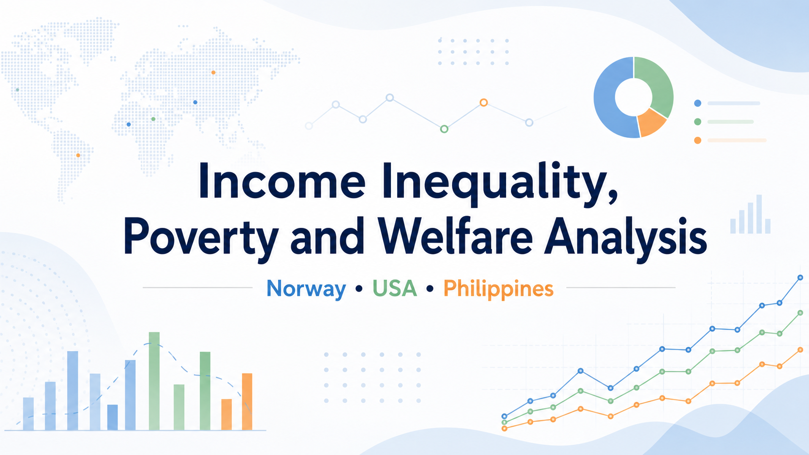
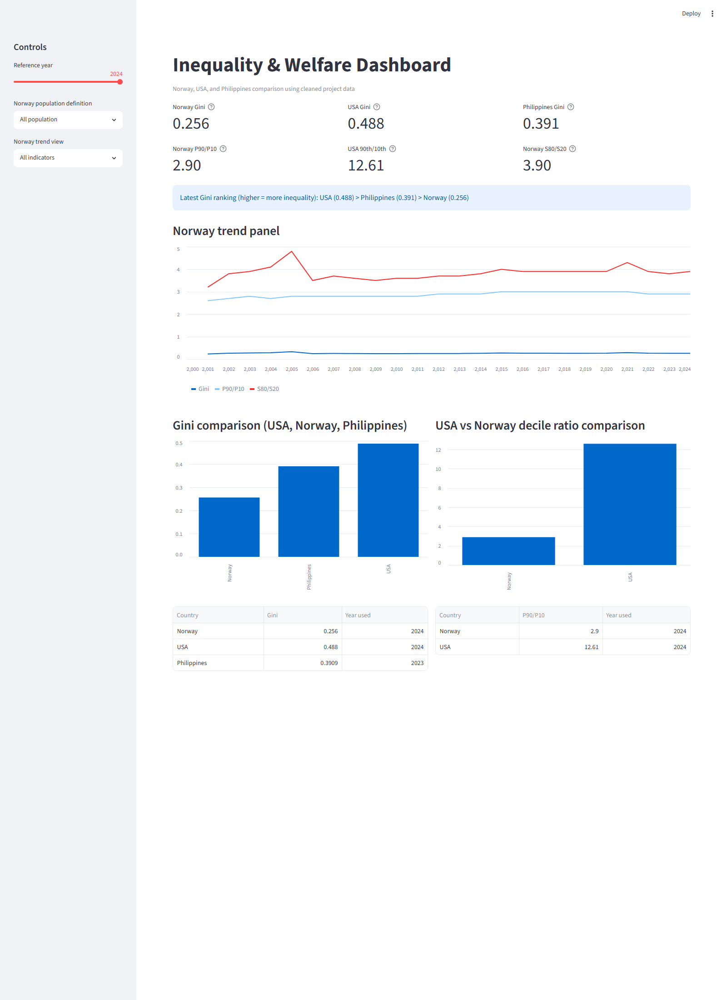
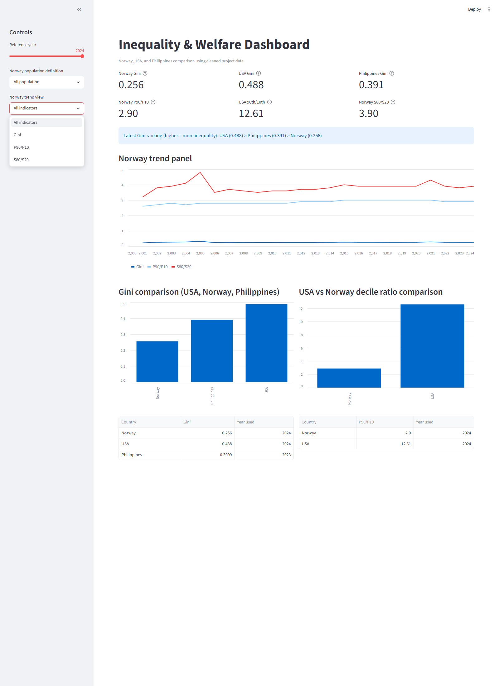

# Income Inequality, Poverty and Welfare Analysis




## Live App

- Streamlit dashboard: https://income-inequality-welfare-analysis-a9ngzr4evattkxng7oaxup.streamlit.app/
- Embed-friendly URL: https://income-inequality-welfare-analysis-a9ngzr4evattkxng7oaxup.streamlit.app/?embed=true

## Overview

This project compares income inequality, poverty, and welfare systems across Norway, the United States, and the Philippines.

It uses official statistics and supporting research to show how public services, redistribution, and welfare policy shape the gap between rich and poor.

It examines how public services and equivalence scales change the interpretation of inequality and poverty, and uses SQL, pandas, and visualization tools to turn raw CSV data into portfolio-ready analysis.

For a short explanation of **SNA vs EU-skala** and why equivalence-scale choice matters, see `docs/methodology.md`.

## Presentation

- PowerPoint walkthrough: [income_inequality_welfare_analysis_presentation_polished.pptx](https://1drv.ms/p/c/4246acc26547a1fc/IQD3jhAcVuRPSYF4dYweL2VpAVFl818193NJHlZWpirrwmc?e=aM2McJ)

The presentation explains the project story from problem framing to data pipeline, dashboard design, core findings for Norway/USA/Philippines, and practical limitations in cross-country comparison.

## Video Walkthrough

- Project walkthrough video: [Add your video link here](https://example.com/video-link)

Recommended video flow: problem context, data and method, live dashboard demo (including CSV upload), key findings, and next improvements.

## Why this project

I wanted to build a portfolio project that shows real data analysis skills, not just charts.

The project combines data collection, cleaning, comparison, visualization, and interpretation in a social and economic context.

## Problem Statement

Official inequality and poverty indicators are often presented separately and are hard to compare across countries with different welfare systems.
This project builds a repeatable pipeline to compare Norway, the USA, and the Philippines using transparent data cleaning, database storage, and clear visual outputs.

## Data Sources

- Statistics Norway (SSB)
- U.S. Census Bureau
- Philippine Statistics Authority (PSA)
- Supporting research on public services, inequality, and welfare effects

## Main Questions

- How does income distribution differ between the three countries?
- What do the data say about the gap between rich and poor?
- How do welfare systems and public services affect poverty and inequality?

## Method

1. Load raw source files into SQLite with `setup_database.py`.
2. Clean and normalize country-specific datasets with `scripts/clean_data.py`.
3. Generate analysis summaries and comparison metrics with `scripts/analyze_data.py`.
4. Generate publication-ready charts/tables with `scripts/make_charts.py`.

## Run the project (end-to-end)

```bash
python setup_database.py
python scripts/clean_data.py
python scripts/analyze_data.py
python scripts/make_charts.py
```

Outputs are written to:

- `outputs/figures/` (charts)
- `outputs/tables/` (summary tables and text outputs)

## Run the Streamlit dashboard

```bash
pip install -r requirements.txt
```

```bash
streamlit run dashboard.py
```

The dashboard includes:

- interactive country/year/filter controls
- Norway/USA/Philippines comparison charts
- welfare-proxy scatter context
- CSV upload pipeline for adding custom country data into SQLite

## Dashboard Screenshots





## Data, Method, and Key Findings

Data sources:

- Statistics Norway (SSB)
- U.S. Census Bureau
- Philippine Statistics Authority (PSA)

Method summary:

1. Load raw data to SQLite (`setup_database.py`).
2. Clean/normalize country tables (`scripts/clean_data.py`).
3. Build comparisons and summaries (`scripts/analyze_data.py`).
4. Serve interactive analysis via Streamlit (`dashboard.py`).

Key findings (current snapshot):

- Norway has the lowest headline inequality (latest Gini in project data).
- USA has the highest headline inequality in the comparison.
- Philippines improved national Gini over time but remains above Norway.

## Publish DB changes to GitHub (one command)

Use the release helper to rebuild data artifacts, run checks, and create a consistent commit.

```bash
python scripts/release_db_snapshot.py
```

What it does:

1. Runs `setup_database.py`
2. Runs `scripts/clean_data.py`
3. Runs `scripts/analyze_data.py`
4. Runs `scripts/make_charts.py` (unless `--skip-charts`)
5. Stages `database/database.db`, `data/processed/`, and `outputs/tables/`
6. Commits and pushes to `origin/main`

Useful flags:

- `--message "your commit message"`
- `--skip-push` (create local commit only)
- `--skip-charts` (faster run)

## Add your own country data in the dashboard

The Streamlit dashboard supports importing country-level inequality data from CSV.

1. Open the dashboard and expand `Add your own country data (CSV)` in the sidebar.
2. Download the template from the app or use `data/country_upload_template.csv`.
3. Upload your CSV and map columns in the UI.
4. Run `Validate and import CSV`.

Minimum required fields:

- `country` (or fixed country name in the UI)
- `year`
- `gini`

Optional fields:

- `p90_p10`
- `s80_s20`
- `welfare_proxy_value`
- `welfare_proxy_label`
- `source`
- `notes`

Validation rules:

- `year` must be numeric and between 1900 and 2100
- `gini` must be numeric and between 0 and 1
- no duplicate `country` + `year` rows in one upload

Imported rows are stored in SQLite and included in country selector, trend chart, ranking, and comparison views.

## Repository Structure

- `data/raw/` — original source files.
- `data/processed/` — cleaned and combined datasets.
- `notebooks/` — exploration and analysis notebooks.
- `scripts/` — reusable Python scripts for cleaning and analysis.
- `outputs/` — charts, tables, and screenshots.
- `docs/` — project description, methodology, and references.
- `assets/` — cover image and badge notes.

## What I Am Building

- Cleaned datasets.
- Comparison tables.
- Charts and dashboards.
- A short portfolio-ready explanation of the findings.

## Current Status

Active and deployable.

- Core ETL pipeline is in place (raw CSV -> SQLite -> cleaned tables).
- Streamlit dashboard is live and updated from the `main` branch.
- Country CSV upload pipeline is implemented with mapping, validation, and persistence.

## Findings (current snapshot)

- **Norway:** lower inequality level overall, but a gradual increase over time.
- **USA:** higher inequality, with a more market-driven distribution pattern.
- **Philippines:** a stronger poverty challenge and a different welfare context than Norway/USA.

## Chart and table interpretation (short)

- `gini_usa_norway_philippines*.png`: compares headline national inequality levels (Gini) across the three countries.
- `norway_gini_p90p10_s80s20.png`: shows that different inequality indicators in Norway move together over time.
- `usa_norway_comparison.png`: highlights the gap between Norway and USA on latest available Gini and P90/P10 ratios.
- `country_headline_comparison.md`: compact, portfolio-ready comparison table with key context indicators.
